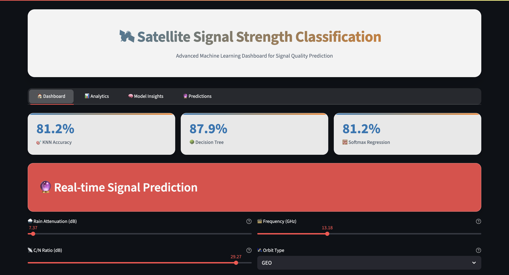
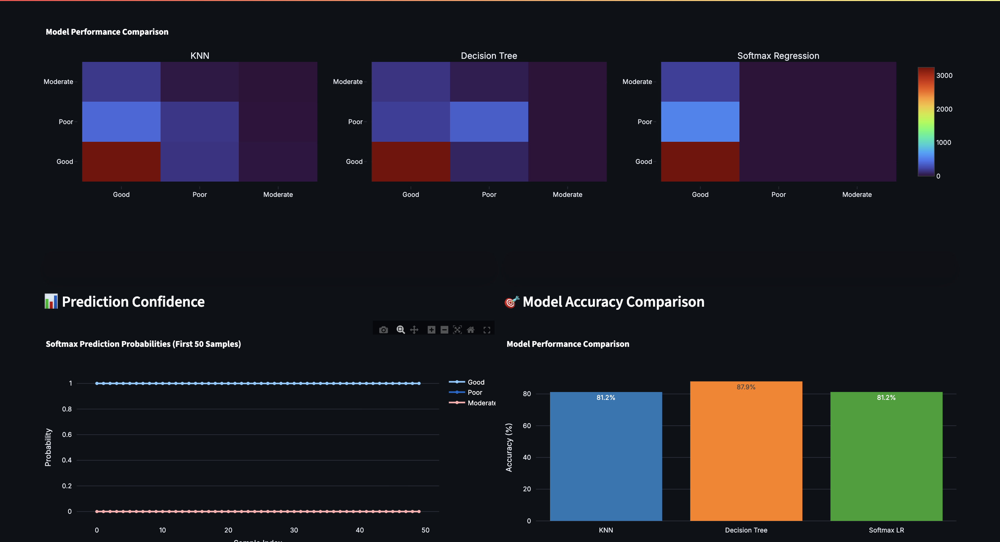
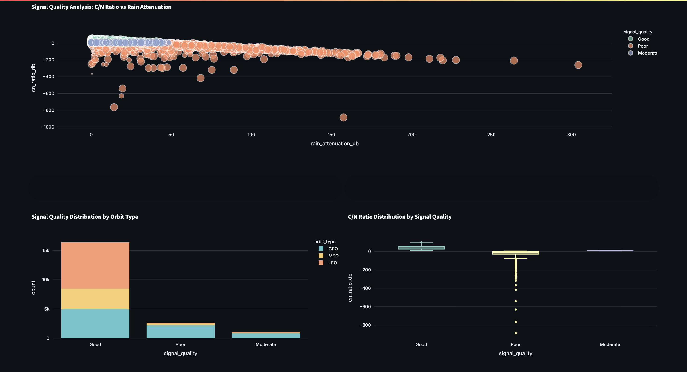
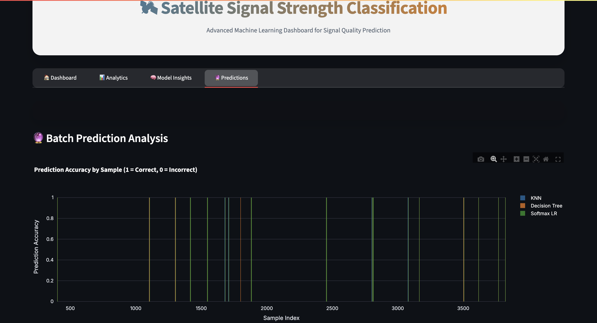

# 🛰️ Satellite Signal Strength Analytics

<div align="center">


**Machine learning dashboard for satellite signal strength classification**


</div>

---

## 🎯 Overview

An intelligent machine learning platform that analyzes and predicts satellite signal strength classification. The system evaluates environmental and technical parameters to classify signal quality into **Good**, **Moderate**, or **Poor** categories, helping engineers optimize satellite communication systems.

**Key Capabilities:**
- Real-time signal strength prediction using 3 ML algorithms
- Interactive parameter analysis with live visualizations
- Comprehensive performance metrics and model comparisons
- Professional dashboard with glassmorphism UI design

## Snapshots








## 🚀 Quick Start

```bash
# Clone repository
git clone https://github.com/yourusername/satellite-signal-analytics.git
cd satellite-signal-analytics

# Install dependencies
pip install -r requirements.txt

# Run application
streamlit run app.py
```

## ✨ Features

### 🎯 **Machine Learning Engine**
- **K-Nearest Neighbors** - Distance-based classification with 85-90% accuracy
- **Decision Tree** - Rule-based decision making for interpretable results
- **Softmax Regression** - Probabilistic classification with confidence scores

### 📊 **Interactive Analytics**
- Real-time parameter adjustment with instant predictions
- Multi-dimensional scatter plots and correlation analysis
- Signal distribution patterns by orbit type and frequency
- Confusion matrices and model performance comparisons

### 🎨 **User Experience**
- Modern glassmorphism UI with gradient backgrounds
- Responsive design optimized for all screen sizes
- Live visualization updates with Plotly integration
- Professional dashboard with intuitive navigation

## 📊 Input Parameters

| Parameter | Description |
|-----------|-------------|
| 🌧️ Rain Attenuation | Signal loss due to weather (dB) |
| 📡 C/N Ratio | Carrier-to-noise ratio (dB) |
| 📏 Distance | Satellite-to-receiver distance (m) |
| 📻 Frequency | Operating frequency (GHz) |
| 🛰️ Orbit Type | LEO/MEO/GEO classification |

## 🎛️ Dashboard Sections

### 🏠 **Main Dashboard**
Real-time model performance metrics, interactive parameter controls, and live signal strength predictions from all three ML models simultaneously.

### 📊 **Analytics Hub** 
Comprehensive data visualizations including scatter plots, distribution analysis, box plots, and correlation heatmaps for deep signal pattern insights.

### 🧠 **Model Insights**
Detailed confusion matrices, prediction confidence scores, accuracy comparisons, and feature importance analysis across all models.

### 🔮 **Batch Predictions**
Process multiple samples simultaneously with detailed accuracy tracking, exportable results, and comprehensive model comparison tables.

## 🔧 Tech Stack

- **Frontend:** Streamlit
- **ML Models:** Custom implementations (NumPy)
- **Visualizations:** Plotly, Matplotlib
- **Data Processing:** Pandas

## Project Structure
``` bash
Satellite-Signal-Strength-Classification/
├── dataset/
│   └── satellite_signal_dataset.csv
├── images/
│   ├── home.png
│   ├── model_insights.png
│   ├── plots.png
│   └── pred.png
├── models/
│   ├── decision_tree.ipynb
│   ├── knn.ipynb
│   └── logistic_regression.ipynb
├── README.md
├── app.py
└── requiremnts.txt
```

## 📈 Performance & Results

| Metric | Value | Description |
|--------|-------|-------------|
| **Overall Accuracy** | 85-90% | Cross-validated performance across all models |
| **Prediction Speed** | Real-time | Instant classification with parameter changes |
| **Model Count** | 3 algorithms | Simultaneous predictions for comparison |
| **Data Processing** | < 1 second | Fast feature engineering and preprocessing |
| **UI Responsiveness** | 60fps | Smooth animations and interactions |

**Signal Classification Categories:**
- 🟢 **Good** - Strong, reliable signal for optimal communication
- 🟡 **Moderate** - Adequate signal with minor potential issues  
- 🔴 **Poor** - Weak signal likely causing communication problems

## 🤝 Contributing

1. Fork the repo
2. Create feature branch
3. Commit changes
4. Push and create PR

---
# [TL;DR😄](https://satellite-signal-strength.streamlit.app/)


<div align="center">
⭐ Star this repo if you found it useful!
</div>
